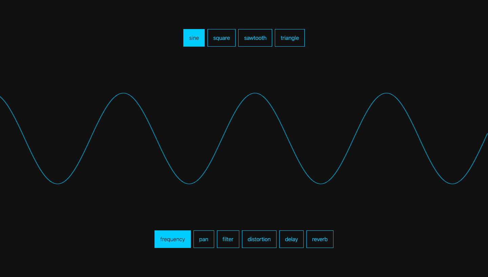
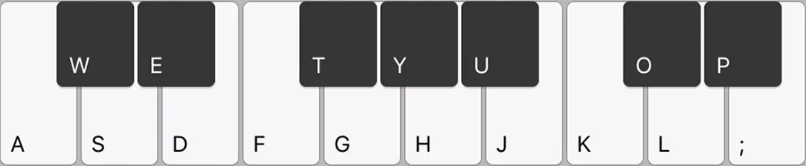

# [WebSynth](https://synth.joextodd.com)

## Settings

Selecting a wave allows you to control the following settings, individually for each oscillator by dragging the mouse across the screen.

Pressing typical keyboard values gives you access to the 12 notes of an octave.

---

### Frequency 

| Axis |         Control        |
|------|------------------------|
|  x   | Frequency value (Hz)   |
|  y   | Wave amplitude         |

### Filter

| Axis |         Control        |
|------|------------------------|
|  x   | Cut off frequency      |
|  y   | Q factor               |

### Distortion

| Axis |         Control        |
|------|------------------------|
|  x   | Gain                   |
|  y   | n/a                    |

### Delay

| Axis |         Control        |
|------|------------------------|
|  x   | Delay time (0-3secs)   |
|  y   | Delay gain             |

### Reverb

| Axis |         Control        |
|------|------------------------|
|  x   | Reverb time (0-3secs)  |
|  y   | Reverb gain            |